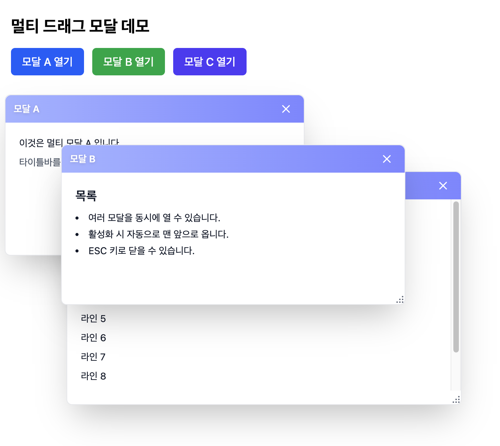

# Laravel Draggable Modal

A Laravel package that provides draggable and resizable modal components with Alpine.js support.



## Features

- 🖱️ **Draggable Modals**: Click and drag modals to reposition them
- 📐 **Resizable**: Resize modals with drag handles
- 🎯 **Multiple Modal Support**: Open multiple modals simultaneously with z-index management
- 🎨 **Alert Modals**: Pre-styled alert modals with success, warning, error, and info variants
- 🎭 **Dark Mode Support**: Built-in dark mode styling
- ⚡ **Alpine.js Integration**: Seamless integration with Alpine.js
- 🎪 **Modal Triggers**: Simple component to trigger modals
- 📱 **Responsive**: Works on desktop and mobile devices

## Requirements

- PHP 8.2 or higher
- Laravel 11.0 or 12.0
- Alpine.js 3.x
- Tailwind CSS

## Installation

Install the package via Composer:

```bash
composer require ssh521/laravel-draggable-modal
```

### (Optional) Publish Sample Views

If you want to try the package quickly, publish the sample views:

```bash
php artisan vendor:publish --tag=draggable-modal-sample-views
```

The package also auto-loads sample routes for convenience:

```
GET /draggable-modal/sample/single
GET /draggable-modal/sample/multi
GET /draggable-modal/sample/alert
GET /draggable-modal/sample/vite
```

> If changes are not reflected after publishing, clear caches:
> ```bash
> php artisan optimize:clear
> ```

### Publish Assets

Publish the views (optional, if you want to customize):

```bash
php artisan vendor:publish --tag=draggable-modal-views
```

Publish the JavaScript files:

```bash
php artisan vendor:publish --tag=draggable-modal-js
```

> Published JS files are copied to:
> `resources/js/vendor/draggable-modal/`

### Setup Alpine.js

Install Alpine.js via npm (if not already installed):

```bash
npm install alpinejs
```

### Setup JavaScript

After publishing, configure your main JavaScript file:

```javascript
// resources/js/app.js
import './bootstrap';
import Alpine from 'alpinejs';

// Make Alpine available globally
window.Alpine = Alpine;

// Import modal initializer BEFORE starting Alpine
import './vendor/draggable-modal/init';

// Start Alpine
Alpine.start();
```

> Important: Import `init` BEFORE `Alpine.start()` so that components and event listeners are registered.

**Alternative method** - Use the modal-manager directly:

```javascript
// resources/js/app.js
import './bootstrap';
import Alpine from 'alpinejs';
import draggableModal from './vendor/draggable-modal/modal-manager';

window.Alpine = Alpine;

document.addEventListener('alpine:init', () => {
    Alpine.data('draggableModal', draggableModal);
});

Alpine.start();
```

### Add Required CSS

Add the `x-cloak` style to your layout or main CSS file:

```html
<!-- In your layout blade file (e.g., resources/views/layouts/app.blade.php) -->
<style>
    [x-cloak] { display: none !important; }
</style>
```

Or add it to your CSS file:

```css
/* resources/css/app.css */
[x-cloak] {
    display: none !important;
}
```

**Important**: The `x-cloak` style is **required** for the modals to work correctly. Without it, modals may not display or hide properly.

> Note: The trigger uses Alpine's `$dispatch`. Ensure triggers and modals are inside an Alpine scope, e.g. wrap with `x-data="{}"`.

## Usage

### Basic Draggable Modal

```blade
<div x-data="{}">
    <x-draggable-modal
        id="my-modal"
        title="My Modal"
        :width="800"
        :height="600">

        <div class="p-4">
            Modal content goes here
        </div>
    </x-draggable-modal>

    <!-- Trigger the modal -->
    <x-modal-trigger
        text="Open Modal"
        modal-id="my-modal" />
</div>
```

### Multi-Modal Support

```blade
<div x-data="{}">
    <x-draggable-modal-multi
        id="modal-1"
        title="First Modal">

        <div class="p-4">
            First modal content
        </div>
    </x-draggable-modal-multi>

    <x-draggable-modal-multi
        id="modal-2"
        title="Second Modal">

        <div class="p-4">
            Second modal content
        </div>
    </x-draggable-modal-multi>

    <!-- Triggers -->
    <x-modal-trigger text="Open Modal 1" modal-id="modal-1" />
    <x-modal-trigger text="Open Modal 2" modal-id="modal-2" />
</div>
```

### Alert Modal

```blade
<div x-data="{}">
    <x-draggable-modal-alert
        id="success-alert"
        title="Success!"
        message="Your action was completed successfully."
        type="success" />

    <!-- Available types: info, success, warning, error -->

    <x-modal-trigger
        text="Show Alert"
        modal-id="success-alert"
        modal-type="alert" />
</div>
```

### Modal Trigger Variants

```blade
<!-- Primary Button (default) -->
<x-modal-trigger
    text="Open Modal"
    modal-id="my-modal"
    variant="primary" />

<!-- Secondary Button -->
<x-modal-trigger
    text="Open Modal"
    modal-id="my-modal"
    variant="secondary" />

<!-- Danger Button -->
<x-modal-trigger
    text="Delete"
    modal-id="delete-modal"
    variant="danger" />

<!-- Link Style -->
<x-modal-trigger
    text="Open Modal"
    modal-id="my-modal"
    type="link"
    variant="primary" />
```

## Component Props

### Draggable Modal / Draggable Modal Multi

| Prop | Type | Default | Description |
|------|------|---------|-------------|
| `id` | string | auto-generated | Unique identifier for the modal |
| `title` | string | '' | Modal title displayed in header |
| `width` | int | 800 | Initial width in pixels |
| `height` | int | 600 | Initial height in pixels |
| `minWidth` | int | 300 | Minimum width in pixels |
| `minHeight` | int | 200 | Minimum height in pixels |
| `initialX` | int\|null | null | Initial X position (centered if null) |
| `initialY` | int\|null | null | Initial Y position (centered if null) |
| `showCloseButton` | bool | true | Show close button in header |
| `showResizeHandle` | bool | true | Show resize handle in corner |
| `closeOnEscape` | bool | true | Close modal on ESC key |
| `closeOnBackdropClick` | bool | false | Close modal when clicking backdrop |

### Draggable Modal Alert

| Prop | Type | Default | Description |
|------|------|---------|-------------|
| `id` | string | auto-generated | Unique identifier for the modal |
| `title` | string | 'Alert' | Alert title |
| `message` | string | '' | Alert message |
| `type` | string | 'info' | Alert type: info, success, warning, error |
| `showCloseButton` | bool | true | Show close button |
| `closeOnBackdropClick` | bool | false | Close on backdrop click |
| `closeOnEscape` | bool | true | Close on ESC key |

### Modal Trigger

| Prop | Type | Default | Description |
|------|------|---------|-------------|
| `text` | string | 'Open Modal' | Button/link text |
| `modal-id` | string | required | ID of the modal to open |
| `variant` | string | 'primary' | Style variant: primary, secondary, danger |
| `type` | string | 'button' | Render as: button, link |
| `modalType` | string | 'multi' | Modal type: multi, single, alert |

## Programmatic Control

You can also trigger modals programmatically using custom events:

```javascript
// Open a modal
window.dispatchEvent(new CustomEvent('open-modal-multi', {
    detail: { modalId: 'my-modal' }
}));

// Close a modal
window.dispatchEvent(new CustomEvent('close-modal-multi', {
    detail: { modalId: 'my-modal' }
}));

// For alert modals
window.dispatchEvent(new CustomEvent('open-alert-modal', {
    detail: { modalId: 'my-alert' }
}));
```

> You can also open a modal by dispatching a DOM event from Blade or JS. The package registers listeners in `resources/js/vendor/draggable-modal/init.js`.

## Livewire Integration

You can trigger modals from Livewire components:

```php
// In your Livewire component
$this->dispatch('open-modal-multi', modalId: 'user-edit-modal');
```

## Customization

### Customizing Views

After publishing the views, you can customize them in:

```
resources/views/vendor/draggable-modal/components/
```

### Customizing JavaScript

After publishing the JavaScript files, you can modify the behavior in:

```
resources/js/vendor/draggable-modal/
```

If you change file locations or names, update your imports accordingly and rebuild assets (`npm run build`).

## Troubleshooting

1. Ensure the `x-cloak` style is present.
2. In `resources/js/app.js`, set `window.Alpine = Alpine;` and import `./vendor/draggable-modal/init` BEFORE `Alpine.start()`.
3. If changes after publishing are not reflected, clear caches:
   ```bash
   php artisan optimize:clear
   ```
4. If it still doesn't work after bundling, rebuild assets:
   ```bash
   npm run build
   ```
5. Check the browser console for errors and verify published paths exist:
   - `resources/js/vendor/draggable-modal/init.js`
   - `resources/js/vendor/draggable-modal/modal-manager.js`

## Browser Support

- Chrome (latest)
- Firefox (latest)
- Safari (latest)
- Edge (latest)

## License

This package is open-sourced software licensed under the [MIT license](LICENSE).

## Credits

- [Philip Shin](https://github.com/philipshin)

## Contributing

Contributions are welcome! Please feel free to submit a Pull Request.